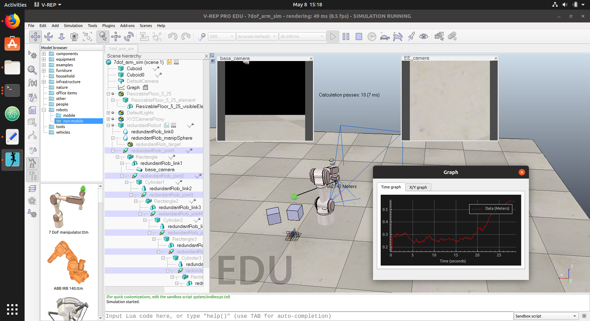
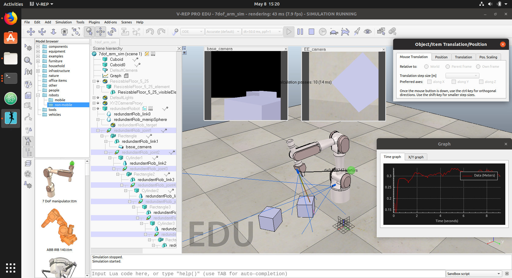
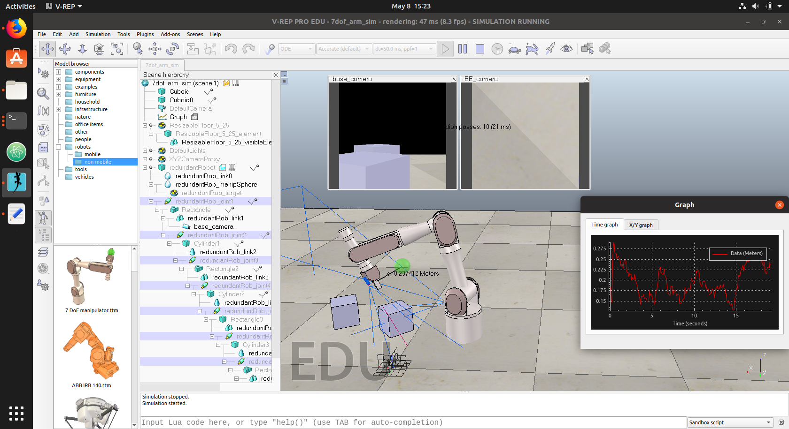
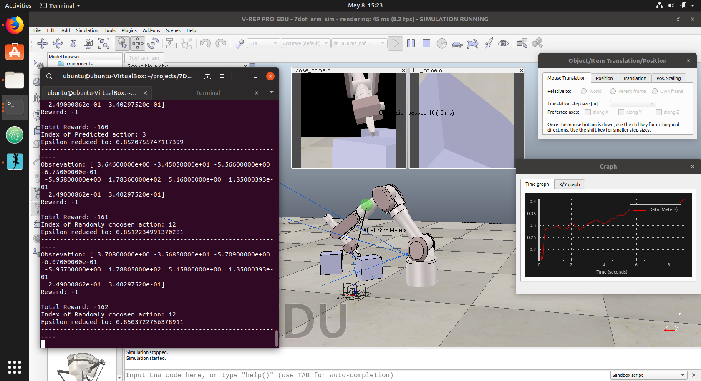
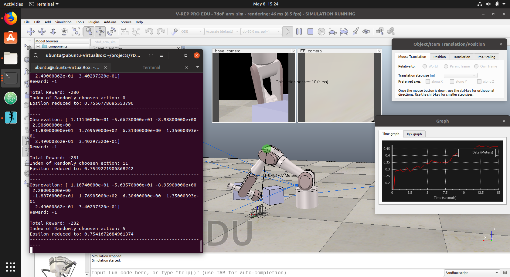

## Description

* A python program that interfaces with the Virtual Robot Experimentation platform (V-REP) and controls the movements of a robot arm.

* It also receives camera images and sensor readings from the robot arm.
* A neural network processes the input data to produce actuation in the Robot's joints so that the end-effector can reach a target position without the use of inverse kinematics.
* The neural network learns about the robot configuration, and movement through reinforcement learning.

## 

### Instructions to Run

1. After creating virtual-env and installing all dependencies from requirements.txt
2. Download V-REP and assign path to installation directory to vrep_dir variable in the "arm_control.py"
3. Also to enable the V-rep python remote api and bindings put the required 3 files in the "vrep_boilerplate" directory. 2 files are from python bindings while the 3rd one is os specific remote api library.
4. Make sure the 7dof_arm_sim.ttt file is in the scenes directory.
5. run the "arm_control.py" file with python.

## In the main() function there are 3 things possible.

### You can un-comment any one.

1. run the random agent (nicely shows, the simulation and arm movement)
2. stream videos from arm (this streams the camera images from the 2 cameras on the arm)
3. RL-agent (Uses neural network (DQL) to control arm) [still under development, the target function for neural network is still not implemented]

**Tested on Windows 10 and Ubuntu Linux 16.4 and 18.4**

## Images

